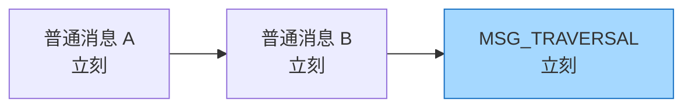
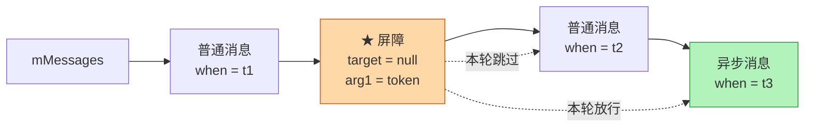
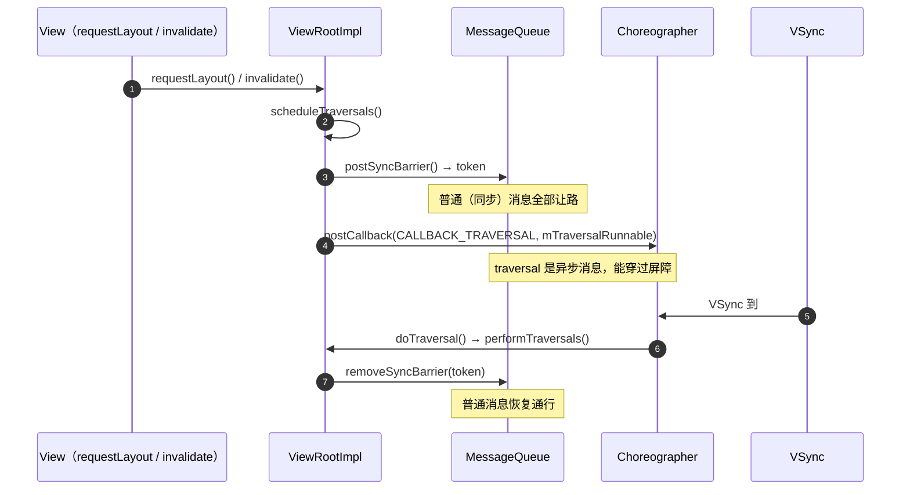

> 同步屏障是 `MessageQueue` 的一种**临时调度特权**：在链表某个位置插一条 `target == null` 的特殊 Message，它之后的所有**同步消息**本轮都不取，只放行**异步消息**。目的是让"这一帧的 traversal"或"一个输入事件"必须立刻跑，不被前面排队的普通消息拖住。

源码位置：

- `frameworks/base/core/java/android/os/MessageQueue.java`（`postSyncBarrier` / `removeSyncBarrier` / `next`）
- `frameworks/base/core/java/android/os/Message.java`（`setAsynchronous`）
- `frameworks/base/core/java/android/view/ViewRootImpl.java`（`scheduleTraversals`）
- `frameworks/base/core/java/android/view/Choreographer.java`（`FrameHandler`）

---

## 1. 为什么需要它

`MessageQueue` 是按 `when` 排序、近似 FIFO 的。假设主线程队列长这样：



A、B 是业务消息（比如某个耗时 `post`），B 后面才是这一帧必须跑的 UI 遍历。**A、B 不处理完，遍历就跑不了**，VSync 一到发现没画，直接掉帧。

同步屏障解决的就是这件事：**允许高时效性的消息越过排在它前面的普通消息**。

> 一句话：队列不再是纯 FIFO，而是「**同步消息 FIFO + 异步消息插队**」。

---

## 2. 原理：一条 `target == null` 的 Message

这是理解同步屏障的关键 —— **屏障不是一个标志位，而是链表里的一条特殊 Message**。

```java
private int mNextBarrierToken;

int postSyncBarrier() {
    return postSyncBarrier(SystemClock.uptimeMillis());
}

private int postSyncBarrier(long when) {
    synchronized (this) {
        final int token = mNextBarrierToken++;       // ★ 每次发屏障都给唯一 token
        final Message msg = Message.obtain();
        msg.markInUse();
        msg.when = when;
        msg.arg1 = token;                            // ★ token 存在 arg1 里
        // ★ 没有 msg.target：屏障不需要被任何 Handler 处理

        Message prev = null;
        Message p = mMessages;
        if (when != 0) {
            while (p != null && p.when <= when) {    // ★ 插到"所有已到点消息"之后
                prev = p;
                p = p.next;
            }
        }
        if (prev != null) { msg.next = p; prev.next = msg; }
        else { msg.next = p; mMessages = msg; }
        return token;
    }
}
```

所以链表某一瞬间可能是：



- **屏障之前的同步消息照常执行**（它们的 `when <= now`，本来就该跑）；
- **屏障之后的同步消息被跳过**；
- **屏障之后的异步消息可以穿过去**。

---

## 3. 消费端

```java
Message next() {
    for (;;) {
        nativePollOnce(ptr, nextPollTimeoutMillis);
        synchronized (this) {
            final long now = SystemClock.uptimeMillis();
            Message prevMsg = null;
            Message msg = mMessages;

            // ★★ 核心：队头是屏障（target == null），就往后找第一条异步消息
            if (msg != null && msg.target == null) {
                do {
                    prevMsg = msg;
                    msg = msg.next;
                } while (msg != null && !msg.isAsynchronous());
            }

            if (msg != null) {
                if (now < msg.when) {
                    nextPollTimeoutMillis = (int) Math.min(msg.when - now, Integer.MAX_VALUE);
                } else {
                    mBlocked = false;
                    if (prevMsg != null) prevMsg.next = msg.next; else mMessages = msg.next;
                    msg.next = null;
                    msg.markInUse();
                    return msg;                       // ★ 返回的是异步消息
                }
            } else {
                nextPollTimeoutMillis = -1;           // ★ 屏障后没有异步消息 → 无限睡
            }
            ...
        }
    }
}
```

两个重要推论：

1. **屏障必须卡在队头才生效。** 判断写的是 `mMessages.target == null`，只有屏障排在最前面时才会进这个分支。`postSyncBarrier()` 把它插在"所有 `when <= now` 的消息之后"，正好保证：同步消息之间的相对顺序不变，屏障卡在下一批的头上。
2. **屏障之后没有异步消息时，队列会无限阻塞**（`nextPollTimeoutMillis = -1`）。这不是 bug，而是"既然只等异步消息，那就等事件来唤醒"——新的异步消息入队时 `enqueueMessage` 会自动 `nativeWake`：

```java
needWake = mBlocked && p.target == null && msg.isAsynchronous();
```

这行就是为「队头是屏障 + 新来的消息是异步的」这个 case 准备的。

---

## 4. 异步消息

```java
// Message
public boolean isAsynchronous() { return (flags & FLAG_ASYNCHRONOUS) != 0; }
public void setAsynchronous(boolean async) { ... }
```

发异步消息的两种方式：

```java
Handler h = Handler.createAsync(looper);                    // API 28+
// 或者
Handler h = new Handler(looper, callback, /* async = */ true);
```

**AOSP 里谁在用异步消息**：

| 使用者 | 说明 |
|---|---|
| `Choreographer.FrameHandler` | `Choreographer` 内部构造时 `super(looper, null, true)`，所以 `mTraversalRunnable` 是异步消息，能越过屏障 |
| `ViewRootImpl` 的输入事件 | 输入阶段用带 `async = true` 的 handler，保证触摸不被普通消息堵住 |
| `InputEventReceiver` | 同理 |

> 注意：**`sendMessage` 默认发的是同步消息**。异步必须显式指定，这也是"异步消息"容易被忽略的原因 —— 它基本只出现在系统 UI 代码里。

---

## 5. 屏障的处理：`ViewRootImpl.scheduleTraversals()`

```java
void scheduleTraversals() {
    if (!mTraversalScheduled) {
        mTraversalScheduled = true;
        mTraversalBarrier = mHandler.getLooper().getQueue().postSyncBarrier();   // ★ 插屏障
        mChoreographer.postCallback(Choreographer.CALLBACK_TRAVERSAL, mTraversalRunnable, null);
        ...
    }
}

void unscheduleTraversals() {
    if (mTraversalScheduled) {
        mTraversalScheduled = false;
        mHandler.getLooper().getQueue().removeSyncBarrier(mTraversalBarrier);    // ★ 撤屏障
        mChoreographer.removeCallbacks(Choreographer.CALLBACK_TRAVERSAL, mTraversalRunnable, null);
    }
}
```

时序图如下：



> 这就是**一次 `requestLayout()` 能在一帧内被优先处理**的原因：屏障挡同步、异步放行，两者必须配对。只有异步消息没有屏障等于没插队；只有屏障没有异步消息等于把队列锁死。

`mTraversalScheduled` 这个布尔量是**去重**用的：一帧内多次 `requestLayout` 只插一次屏障、只发一次 traversal。

---

## 6. 撤屏障：`removeSyncBarrier(token)`

```java
void removeSyncBarrier(int token) {
    synchronized (this) {
        Message prev = null;
        Message p = mMessages;
        // ★ 按 token 找到那条 target == null 的屏障
        while (p != null && (p.target != null || p.arg1 != token)) {
            prev = p;
            p = p.next;
        }
        if (p == null) {
            throw new IllegalStateException("The specified message queue synchronization "
                    + " barrier token has not been posted or has already been removed.");
        }
        final boolean needWake;
        if (prev != null) { prev.next = p.next; needWake = false; }
        else {
            mMessages = p.next;
            needWake = mMessages == null || mMessages.target != null;
        }
        p.recycleUnchecked();          // ★ 屏障也是从对象池拿的，要还回去
        if (needWake) nativeWake(mPtr);
    }
}
```

注意 **token 机制**：屏障没有 target，只能靠 `arg1` 里的 token 认领。所以 `postSyncBarrier()` 的返回值必须存下来（`mTraversalBarrier`），丢了就撤不掉，队列会被永久卡住。

---

## 7. 崩溃

```
java.lang.IllegalStateException: The specified message queue synchronization
barrier token has not been posted or has already been removed
```

它虽然常出现在 `ViewRootImpl` 的 log 里，但异常是 `MessageQueue.removeSyncBarrier()` 抛的 —— 意思是**拿 `mTraversalBarrier` 去找，却没找到那条屏障**。典型原因：

1. **同一个 token 被 remove 了两次**：`unscheduleTraversals()` 重入，或业务代码自己 `removeSyncBarrier()` 过；
2. **屏障被别人抢先撤掉**：同一个 `MessageQueue` 上有多处 `postSyncBarrier` / `removeSyncBarrier`，token 串了；
3. **队列已经 `quit()`**：`dispose()` 之后屏障没了，再 remove 就抛。

对应博客参考：[MessageQueue 同步屏障异常分析](https://juejin.cn/post/7310571761044160575)。
