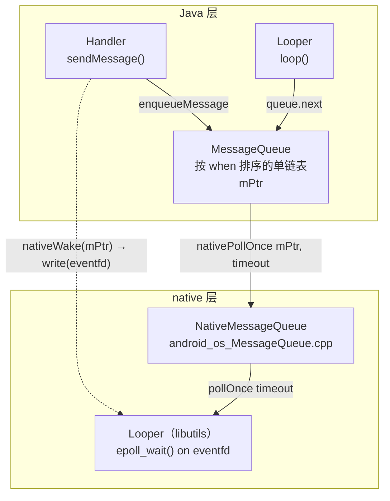
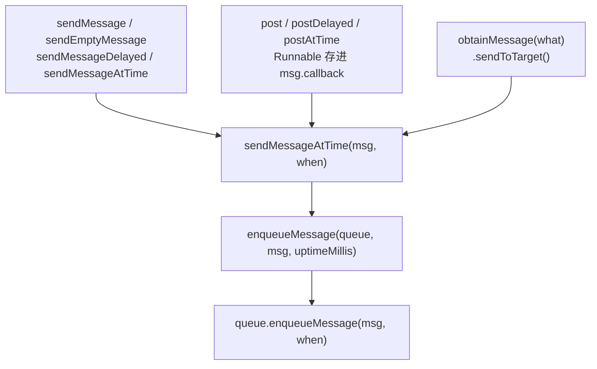

源码位置：

- `frameworks/base/core/java/android/os/Handler.java`
- `frameworks/base/core/java/android/os/Message.java`
- `frameworks/base/core/java/android/os/MessageQueue.java`
- `frameworks/base/core/java/android/os/Looper.java`
- `frameworks/base/core/jni/android_os_MessageQueue.cpp`
- `system/core/libutils/Looper.cpp`（native 的 Looper，跟 Java 的 Looper 同名，但是两个完全不同的东西）

---

## 在体系中的位置



> 每个线程一个 `Looper`、一个 `MessageQueue`；`Handler` 可以在任意线程创建，但必须指向某个已存在的 `Looper`（靠 `ThreadLocal<Looper> sThreadLocal` 找到）。

> **Handler 是消息的发送者和最终处理者，Message 是消息载体，MessageQueue 是消息仓库/调度器，Looper 是消息循环发动机**。它们共同组成 Android 的线程消息机制。

### Handler

- 发送消息：`sendMessage`、`post` 等。
    
- 入队：把 `Message` 交给它绑定的 `MessageQueue`。
    
- 处理消息：`dispatchMessage` 最终回调到 `handleMessage` 或 `Runnable`。
    
- 绑定关系：一个 Handler 绑定一个 Looper，因此也绑定该 Looper 所在的线程和 MessageQueue。
    
- 同一个 Looper 可以对应多个 Handler。
    

### Message

- 消息实体，携带数据：`what`、`arg1`、`arg2`、`obj`、`callback`、`when` 等。
    
- 关键字段 `target`：指向发送它的 Handler。
    
- 支持复用：`Message.obtain()`，避免频繁创建对象。
    
- 延迟消息通过 `when` 表示预期执行时间。
    

### MessageQueue

- 消息队列，但底层不是普通 FIFO 队列，而是**按 `when` 排序的单链表**。
    
- 负责入队：`enqueueMessage`。
    
- 负责取消息：`next`，由 Looper 调用。
    
- 没有消息或消息未到时间时，通过 native 层阻塞，避免 CPU 空转。
    
- 支持同步屏障、异步消息、IdleHandler。
    
- 一个 Looper 对应一个 MessageQueue。
    

### Looper

- 消息循环引擎。
    
- `Looper.prepare()`：为当前线程创建 Looper 和 MessageQueue，并通过 ThreadLocal 保证一个线程只有一个 Looper。
    
- `Looper.loop()`：死循环调用 `MessageQueue.next()` 取消息。
    
- 取到消息后执行：`msg.target.dispatchMessage(msg)`，也就是交给发送该消息的 Handler 处理。
    
- 主线程的 Looper 由 `ActivityThread.main()` 中的 `Looper.prepareMainLooper()` 和 `Looper.loop()` 创建并运行。
---

## Message

```java
public final class Message implements Parcelable {
    public int what;
    public int arg1, arg2;
    public Object obj;
    public Messenger replyTo;
    Bundle data;
    Handler target;      // 谁来处理我
    Runnable callback;   // post() 进来的 Runnable 存这里
    long when;           // 期望执行时刻（SystemClock.uptimeMillis）
    Message next;        // 链表指针 + 对象池指针，一物两用
}
```

两点容易忽略的：

**① `next` 一物两用**：在队列里是链表指针；在对象池里也是链表指针（池本身就是一条用 `next` 串起来的单向链表）。

**② 对象池上限 `MAX_POOL_SIZE = 50`**：

```java
public static Message obtain() {
    synchronized (sPoolSync) {
        if (sPool != null) {
            Message m = sPool;
            sPool = m.next;
            m.next = null;
            m.flags = 0;            // 清掉 FLAG_IN_USE
            sPoolSize--;
            return m;
        }
    }
    return new Message();           // 池空了才 new
}
```

`Looper.loop()` 处理完一条消息后会调 `msg.recycleUnchecked()`：清空所有字段、置上 `FLAG_IN_USE`，再塞回池子。

---

## MessageQueue

```java
public final class MessageQueue {
    Message mMessages;          // 链表头 = 最早要执行的那条
    private long mPtr;          // 指向 native 的 NativeMessageQueue
    private final boolean mQuitAllowed;
    private boolean mBlocked;
    private boolean mQuitting;
    private final ArrayList<IdleHandler> mIdleHandlers = new ArrayList<>();
}
```

### enqueueMessage：有序插入 + 按需唤醒

```java
boolean enqueueMessage(Message msg, long when) {
    if (msg.target == null) throw new IllegalArgumentException("Message must have a target.");
    if (msg.isInUse()) throw new IllegalStateException(msg + " This message is already in use.");
    synchronized (this) {
        if (mQuitting) { msg.recycle(); return false; }
        msg.markInUse();
        msg.when = when;
        Message p = mMessages;
        boolean needWake;
        if (p == null || when == 0 || when < p.when) {
            msg.next = p;
            mMessages = msg;
            needWake = mBlocked;                    // 插到队头，且线程正睡着 → 必须叫醒
        } else {
            needWake = mBlocked && p.target == null && msg.isAsynchronous();
            Message prev;
            for (;;) {
                prev = p;
                p = p.next;
                if (p == null || when < p.when) break;
                if (needWake && p.isAsynchronous()) needWake = false;   // 前面已有异步消息，不急
            }
            msg.next = p;
            prev.next = msg;
        }
        if (needWake) nativeWake(mPtr);
    }
    return true;
}
```

三个要点：

- **按 `when` 有序插入**，不是普通 FIFO。所以 `postDelayed` 的消息会插到合适位置，而不是排到队尾。
- **`needWake` 只在必要时为 true**：只有线程确实阻塞着（`mBlocked`）且这条消息真的会改变"下一个被取走的消息"时才唤醒。
- `p.target == null && msg.isAsynchronous()` 是专门处理 [[同步屏障]] 的：队头是屏障时，只有异步消息值得唤醒。

### next()：睡与醒

```java
Message next() {
    final long ptr = mPtr;
    if (ptr == 0) return null;              // Looper 已 dispose
    int pendingIdleHandlerCount = -1;
    int nextPollTimeoutMillis = 0;          // 0 = 不睡，先轮询一次
    for (;;) {
        if (nextPollTimeoutMillis != 0) Binder.flushPendingCommands();
        nativePollOnce(ptr, nextPollTimeoutMillis);      // ★ 阻塞在这里
        synchronized (this) {
            final long now = SystemClock.uptimeMillis();
            Message prevMsg = null;
            Message msg = mMessages;
            if (msg != null && msg.target == null) {
                // 队头是同步屏障：往后跳，只找异步消息
                do { prevMsg = msg; msg = msg.next; } while (msg != null && !msg.isAsynchronous());
            }
            if (msg != null) {
                if (now < msg.when) {
                    nextPollTimeoutMillis = (int) Math.min(msg.when - now, Integer.MAX_VALUE);
                } else {
                    mBlocked = false;
                    if (prevMsg != null) prevMsg.next = msg.next; else mMessages = msg.next;
                    msg.next = null;
                    msg.markInUse();
                    return msg;                  // ★ 交给 Looper
                }
            } else {
                nextPollTimeoutMillis = -1;      // 没消息 → 无限睡
            }
            if (mQuitting) { dispose(); return null; }   // ★ 返回 null，loop() 退出

            // …… IdleHandler 的处理，见第 7 节
        }
    }
}
```

`nativePollOnce(ptr, timeoutMillis)` 的语义就是 `epoll_wait` 的 timeout：

| timeout | 含义 |
|---|---|
| `< 0` | **无限阻塞**，直到被 `nativeWake` 唤醒 |
| `0` | 不阻塞，立刻返回（队列空，也要先看一眼） |
| `> 0` | 最多睡这么久，或被提前唤醒（下一条定时消息到点） |

> **"主线程死循环为什么不卡死"：没消息时线程真的阻塞在 `epoll_wait` 上，不会占用 CPU**；有消息时被 `write` 到 eventfd 唤醒。

### quit / quitSafely

- `quit()`：`mQuitting = true` + `nativeWake`，`next()` 下次直接 `dispose()` 返回 `null`，**丢弃全部待处理消息**。
- `quitSafely()`：也置 `mQuitting`，但 `next()` 会先把 `when <= now` 的消息处理完再返回 null（延迟消息被丢掉）。

主线程 Looper 由 `prepareMainLooper()` 创建（`quitAllowed = false`），**不允许 quit**，否则抛：

```
java.lang.IllegalStateException: Main thread not allowed to quit.
```

---

## Looper：

```java
public final class Looper {
    static final ThreadLocal<Looper> sThreadLocal = new ThreadLocal<Looper>();
    private static Looper sMainLooper;
    final MessageQueue mQueue;
    final Thread mThread;

    public static void prepare() { prepare(true); }
    private static void prepare(boolean quitAllowed) {
        if (sThreadLocal.get() != null)
            throw new RuntimeException("Only one Looper may be created per thread");
        sThreadLocal.set(new Looper(quitAllowed));
    }
    public static void prepareMainLooper() {
        prepare(false);                       // 主线程不允许 quit
        synchronized (Looper.class) { ... sMainLooper = myLooper(); }
    }
    public static @Nullable Looper myLooper() { return sThreadLocal.get(); }
}
```

`loop()`：

```java
public static void loop() {
    final Looper me = myLooper();
    if (me == null) throw new RuntimeException(
            "No Looper; Looper.prepare() wasn't called on this thread.");
    final MessageQueue queue = me.mQueue;
    final long ident = Binder.clearCallingIdentity();
    for (;;) {
        Message msg = queue.next();          // ★ 可能阻塞很久
        if (msg == null) return;             // 队列退出
        msg.target.dispatchMessage(msg);     // ★ 回到 Handler
        msg.recycleUnchecked();              // ★ 回收进对象池
    }
}
```

子线程里的标准写法：

```java
class Worker extends Thread {
    public Handler handler;
    @Override public void run() {
        Looper.prepare();                    // ① 建 Looper + MessageQueue
        handler = new Handler(Looper.myLooper()) {
            @Override public void handleMessage(Message msg) { /* ... */ }
        };
        Looper.loop();                       // ② 开始循环（阻塞在这里）
        // 只有 Looper.quit() 之后才会走到这里
    }
}
```

主线程的 Looper 在 [[APP 启动过程详解|ActivityThread.main()]] 里建：

```java
public static void main(String[] args) {
    Looper.prepareMainLooper();      // ★ 先建主线程 Looper
    ActivityThread thread = new ActivityThread();
    thread.attach(false, startSeq);
    Looper.loop();                   // ★ 从此主线程不再返回
    throw new RuntimeException("Main thread loop unexpectedly exited");
}
```

> `Binder.clearCallingIdentity()` 是为了不让循环里的 IPC 调用继承调用者的 uid/pid，属于安全细节。

---

## Handler：

```java
public Handler(@Nullable Callback callback, boolean async) {
    mLooper = Looper.myLooper();
    if (mLooper == null) {
        throw new RuntimeException(
            "Can't create handler inside thread " + Thread.currentThread()
            + " that has not called Looper.prepare()");
    }
    mQueue = mLooper.mQueue;
    mCallback = callback;
    mAsynchronous = async;
}
```

这就是子线程 `new Handler()` 崩溃那句话的来源：**Handler 必须有一个 Looper 兜着** —— 要么构造时传进去，要么当前线程已经 `prepare()` 过。

### 消息链路



`post(Runnable)` 与 `sendMessage` 的差别只有一个：Runnable 被塞进 `msg.callback`。

### 取消息的优先级

```java
public void dispatchMessage(@NonNull Message msg) {
    if (msg.callback != null) {
        handleCallback(msg);                          // ① post 进来的 Runnable
    } else {
        if (mCallback != null) {
            if (mCallback.handleMessage(msg)) return; // ② 构造时传的 Callback
        }
        handleMessage(msg);                           // ③ 子类重写
    }
}
```

① `msg.callback` **优先于一切**，所以 `post(r)` 的 r 不会被 `mCallback` / `handleMessage` 截胡；
② `Handler.Callback` 返回 `true` 表示已消费，不再走 `handleMessage`（这是"不想继承 Handler"的写法）。

### 异步消息

`Handler.createAsync(looper)` 或 `new Handler(looper, callback, /* async */ true)` 发出的消息 `isAsynchronous() == true`，**可以越过 [[同步屏障]]**。UI 里的 traversal 和输入事件就是这么发的。

